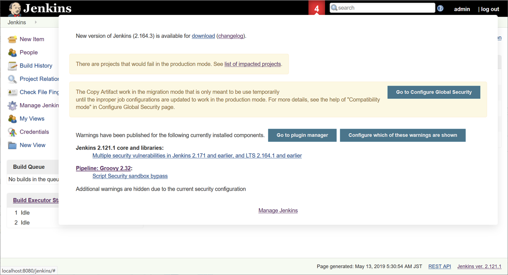
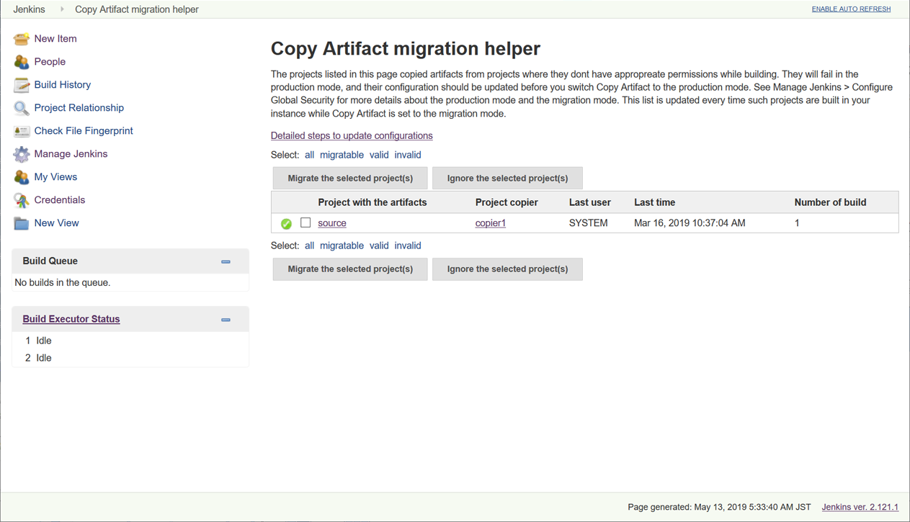

= Copy Artifact plugin

:sectanchors:

Adds a build step to copy artifacts from another project.

The plugin lets you specify which build to copy artifacts from (e.g. the
last successful/stable build, by build number, or by a build parameter).
You can also control the copying process by filtering the files being
copied, specifying a destination directory within the target project,
etc. Click the help icon on each field to learn the details, such as
selecting Maven or multiconfiguration projects or using build
parameters. You can also copy from the workspace of the latest completed
build of the source project, instead of its artifacts. All artifacts
copied are automatically
link:https://www.jenkins.io/doc/book/using/fingerprints/[fingerprinted] for
you.

#image:docs/images/screenshot-copy-artefacts.png[image]#

:toc:

[[CopyArtifactPlugin-Pipelinesyntax]]
== Pipeline syntax

* To copy artifacts from the latest stable build of "sourceproject"
+
[source,groovy]
----
copyArtifacts(projectName: 'sourceproject');
----
* To copy artifacts from the specific build of "downstream"
+
[source,groovy]
----
def built = build('downstream');  // https://plugins.jenkins.io/pipeline-build-step
copyArtifacts(projectName: 'downstream', selector: specific("${built.number}"));
----
* Parameters of copyArtifacts
+
[cols=",,",options="header",]
|===
|parameter |type |description
|projectName |string |the name of project (required)

|selector |BuildSelector |the selector to select the build to copy from.
If not specified, latest stable build is used.

|parameters |string |comma-separated name and value pairs
(name1=value1,name2=value2) to filter the build to copy from.

|filter |string |ant-expression to filter artifacts to copy

|excludes |string |ant-expression to exclude artifacts to copy

|target |string |target directory to copy to

|flatten |boolean |ignore directory structures of artifacts

|optional |boolean |do not fail the step even if no appropriate build is
found.

|fingerprintArtifacts |boolean |fingerprint artifacts to track builds
using those artifacts. false for default if the parameter isn't specified
(Snippet Generator defaults this to true and specifies the parameter).

|resultVariableSuffix |boolean |useless for pipelines
|includeBuildNumberInTargetPath |boolean |Include source build number in target path.
|===
* selectors
+
[cols=",",options="header",]
|===
|name |feature
|lastSuccessful |Latest successful build
|specific |Specific build
|permalink |Specified by permalink
|lastCompleted |completed build (ignoring build status)
|latestSavedBuild |Latest saved build (marked "keep forever")
|buildParameter |Specified by a build parameter
|upstream |Upstream build that triggered this job
|===

[[CopyArtifactPlugin-ConfigurationNotes]]
== Configuration Notes

* When using this plugin with a Windows agent node that is configured as
a Windows service, the service should have permission to interact with
desktop (select "Allow service to interact with desktop" from Jenkins
Agent service properties). Otherwise you may see errors similar to this:
+
....
ERROR: Failed to copy artifacts from ...
hudson.util.IOException2: java.lang.IllegalAccessError: class hudson.remoting.Pipe$ConnectCommand cannot
  access its superclass hudson.remoting.Command
at hudson.FilePath.copyRecursiveTo(FilePath.java:1526)
at hudson.FilePath.copyRecursiveTo(FilePath.java:1451)
at hudson.plugins.copyartifact.FilePathCopyMethod.copyAll(FilePathCopyMethod.java:51)
...
....

[[CopyArtifactPlugin-RecommendedusageofCopyartifact]]
== Recommended usage of copy artifact

* Artifacts should be stored as archived files.
** Copyartifact tries to copy artifacts preserving file attributes like
permissions and symbolic links. Though, it may fail in some situations
(like for security issues).
** It's highly recommended to pack files to copy into an archive file,
using `+tar+` command
or link:https://jenkins.io/doc/pipeline/steps/pipeline-utility-steps/#zip-create-zip-file[`+zip+`
pipeline step], especially when it's important for you to preserving
file attributes or directory structures.

[[CopyArtifactPlugin-Permissionstocopyartifact]]
== Permissions to copy artifact

NOTE: Since version 1.44, Copy Artifact checks permissions more thoroughly in its default Production mode. If you have permission issues when upgrading from copyartifact 1.43.1 or earlier you can use <<CopyArtifactPlugin-MigrationMode,Migration Mode>>. You should convert to Production mode as soon as possible.

When you face a following message and fail to copy artifacts, this may
be caused by permission to the job with artifacts. Please read this
section once.

....
Unable to find project for artifact copy: YOUR_PROJECT_WITH_ARTIFACTS
This may be due to incorrect project name or permission settings; see help for project name in job configuration.
Build step 'Copy artifacts from another project' marked build as failure
....

You can configure to allow Copy Artifact to access source jobs in the following ways.

* <<CopyArtifactPlugin-Specifyprojectswhocancopyartifacts,Configure source jobs specifying jobs who can copy artifacts.>>
* <<CopyArtifactPlugin-Authorizebuildsasauser,Authorize builds as a user.>>

[[CopyArtifactPlugin-Specifyprojectswhocancopyartifacts]]
==== Specify projects who can copy artifacts

* In the job configuration pages, you can specify jobs to allow
copy artifacts from that project: +
#image:docs/images/permissions_06_copypermission.png[image]#
* Use `+copyArtifactPermission+` in pipelines:
** Declarative pipeline:
+
[source,groovy]
----
pipeline {
    agent any;
    options {
        copyArtifactPermission('job1,job2,...');
    }
    stages{...}
}
----
** Scripted pipeline
+
[source,groovy]
----
properties([
    copyArtifactPermission('job1,job2,...'),
]);
node {
    ...
}
----
* You can specify multiple jobs separated by commas.
* You can use wildcard character ('*') to specify name patterns.

[[CopyArtifactPlugin-Authorizebuildsasauser]]
==== Authorize builds as a user

* https://plugins.jenkins.io/authorize-project/[Authorize Project plugin] enables you to run builds of a project as a specific user.
** Copy Artifact treats builds running as anonymous without authorization configurations.
* You can resolve permission problems by running builds as a user with read permission to the project with artifacts +
#image:docs/images/permissions_07_authorizeproject.png[image]#

[[CopyArtifactPlugin-MigrationMode]]
=== Migration Mode

Migration mode is available and automatically enabled for users upgrading Copy Artifact from 1.43.1 or earlier.

Migration mode performs permission checks when configuring jobs
or when running builds if the name of the source job is
configured with variables.
This is the behavior compatible to Copy Artifact 1.43.1 or earlier.

This may cause security vulnerabilities allowing malicious users
to bypass permission checks.
This mode is provided only to allow users to upgrade job configurations
and migrate to Production mode easily. You should migrate to Production mode as soon as you can.

Build executions that would fail in Production mode are
recorded and displayed as warnings to administrators.

##

Administrators should check those warnings
and update the job configurations to successfully use Production mode.

##

[[CopyArtifactPlugin-Usewithdeclarativepipelines]]
== Use with declarative pipelines

One example:

[source,groovy]
----
stages {
    stage('Copy Archive') {
         steps {
             script {
                step ([$class: 'CopyArtifact',
                    projectName: 'Create_archive',
                    filter: "packages/infra*.zip",
                    target: 'Infra']);
            }
        }
    }
...
}
----

What that is doing:

* Go to the project/workspace named "Create_archive".
* Look in the folder "packages" for the file(s) "infra*.zip".
* Copy that file(s) into the folder "Infra", in the local workspace.
Folder will be created if it doesn't already exist.

[[CopyArtifactPlugin-Issues]]
## Reporting Issues

Report issues in the link:https://www.jenkins.io/participate/report-issue/redirect/#15692[Jenkins issue tracker].
Please use the link:https://www.jenkins.io/participate/report-issue/["How to Report an Issue"] guidelines when reporting issues.

* https://issues.jenkins.io/issues/?jql=resolution%20is%20EMPTY%20and%20component%3D15692[Open Issues]

== Release History

Changelogs for current releases are recorded in link:https://github.com/jenkinsci/copyartifact-plugin/releases[GitHub releases]

Changelogs for previous releases are recorded in the link:https://github.com/jenkinsci/copyartifact-plugin/blob/8598cd8c4aa8724680a8e286eb314202249c3049/CHANGELOG.adoc[legacy changelog].
