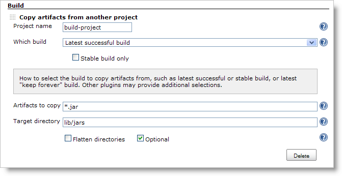
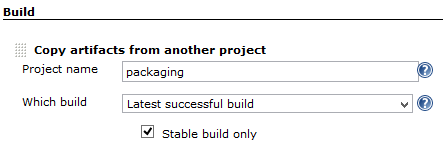
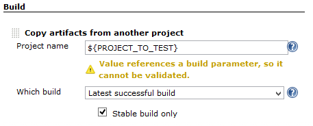
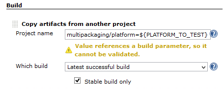
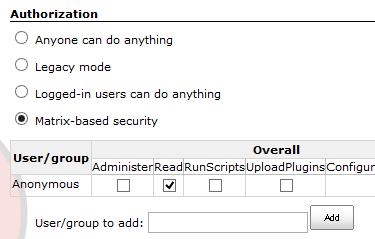
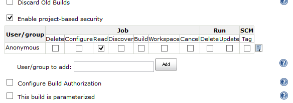
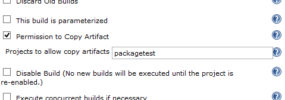
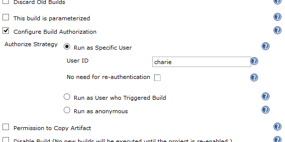

= Copy Artifact plugin

:sectanchors:

Adds a build step to copy artifacts from another project.

The plugin lets you specify which build to copy artifacts from (e.g. the
last successful/stable build, by build number, or by a build parameter).
You can also control the copying process by filtering the files being
copied, specifying a destination directory within the target project,
etc. Click the help icon on each field to learn the details, such as
selecting Maven or multiconfiguration projects or using build
parameters. You can also copy from the workspace of the latest completed
build of the source project, instead of its artifacts. All artifacts
copied are automatically
https://wiki.jenkins.io/display/JENKINS/Fingerprint[fingerprinted] for
you.

##

:toc:

[[CopyArtifactPlugin-Pipelinesyntax]]
== Pipeline syntax

Available since copyartifact-1.39

* To copy artifacts from the latest stable build of "sourceproject"
+
[source,groovy]
----
copyArtifacts(projectName: 'sourceproject');
----
* To copy artifacts from the specific build of "downstream"
+
[source,groovy]
----
def built = build('downstream');  // https://plugins.jenkins.io/pipeline-build-step
copyArtifacts(projectName: 'downstream', selector: specific("${built.number}"));
----
* Parameters of copyArtifacts
+
[cols=",,",options="header",]
|===
|parameter |type |description
|projectName |string |the name of project (required)

|selector |BuildSelector |the selector to select the build to copy from.
If not specified, latest stable build is used.

|parameters |string |comma-separated name and value pairs
(name1=value1,name2=value2) to filter the build to copy from.

|filter |string |ant-expression to filter artifacts to copy

|excludes |string |ant-expression to exclude artifacts to copy

|target |string |target directory to copy to

|flatten |boolean |ignore directory structures of artifacts

|optional |boolean |do not fail the step even if no appropriate build is
found.

|fingerprintArtifacts |boolean |fingerprint artifacts to track builds
using those artifacts. true for default

|resultVariableSuffix |boolean |useless for pipelines
|===
* selectors
+
[cols=",",options="header",]
|===
|name |feature
|lastSuccessful |Latest successful build
|specific |Specific build
|permalink |Specified by permalink
|lastCompleted |completed build (ignoring build status)
|latestSavedBuild |Latest saved build (marked "keep forever")
|buildParameter |Specified by a build parameter
|upstream |Upstream build that triggered this job
|===

[[CopyArtifactPlugin-ConfigurationNotes]]
== Configuration Notes

* When using this plugin with a Windows slave node that is configured as
a Windows service, the service should have permission to interact with
desktop (select "Allow service to interact with desktop" from Jenkins
Slave service properties). Otherwise you may see errors similar to this:
+
....
ERROR: Failed to copy artifacts from ...
hudson.util.IOException2: java.lang.IllegalAccessError: class hudson.remoting.Pipe$ConnectCommand cannot
  access its superclass hudson.remoting.Command
at hudson.FilePath.copyRecursiveTo(FilePath.java:1526)
at hudson.FilePath.copyRecursiveTo(FilePath.java:1451)
at hudson.plugins.copyartifact.FilePathCopyMethod.copyAll(FilePathCopyMethod.java:51)
...
....

[[CopyArtifactPlugin-RecommendedusageofCopyartifact]]
== Recommended usage of Copyartifact

* Artifacts should be stored as archived files.
** Copyartifact tries to copy artifacts preserving file attributes like
permissions and symbolic links. Though, it may fail in some situations
(like for security issues).
** It's highly recommended to pack files to copy into an archive file,
using `+tar+` command
or link:https://jenkins.io/doc/pipeline/steps/pipeline-utility-steps/#zip-create-zip-file[`+zip+`
pipeline step], especially when it's important for you to preserving
file attributes or directory structures.

[[CopyArtifactPlugin-Permissionstocopyartifact]]
== Permissions to copy artifact

When you face a following message and fail to copy artifacts, this may
be caused by permission to the project with artifacts. Please read this
section once.

....
Unable to find project for artifact copy: YOUR_PROJECT_WITH_ARTIFACTS
This may be due to incorrect project name or permission settings; see help for project name in job configuration.
Build step 'Copy artifacts from another project' marked build as failure
....

[[CopyArtifactPlugin-Specifyingprojectstatically-withoutvariables]]
=== Specifying project statically (without variables)

* This case: +
##

* In this case, you can copy artifacts if you have permission to read
the project to copy from at configuration time.

[[CopyArtifactPlugin-Specifyingprojectdynamically-withvariables]]
=== Specifying project dynamically (with variables)

* Those cases: +
## +
##

* If https://jenkins.io/doc/book/system-administration/security/[your
Jenkins is secured], *it fails to copy artifacts without a proper
configuration*.
* You need to allow projects copy artifacts in one of following ways:

[[CopyArtifactPlugin-Allowreadfromanonymous]]
==== Allow read from anonymous

* Copyartifact plugin treats builds running as an anonymous.
* Copying artifacts is allowed if the project with artifacts is readable
from anonymous.
* When you use
https://wiki.jenkins.io/display/JENKINS/Matrix-based+security[Matrix-based
security] for authorization, it can be done as following in Manage
Jenkins > Global Security Configuration: +
##
* When you use Project-based Matrix Authorization Strategy for
authorization, it can be done as following in the configuration page of
the project to copy artifacts from: +
##

[[CopyArtifactPlugin-Specifyprojectswhocancopyartifacts]]
==== Specify projects who can copy artifacts

* *Available since Copyartifact 1.30*
* In the project configuration pages, you can specify projects to allow
copy artifacts from that project: +
##
* You can specify multiple projects with separating with commas.
* You can use wildcard character ('*') to specify name patterns.

WARNING: Since Copyartifact 1.30, there is a limitation "Permission to Copy
Artifacts" accepts only relative project names. +
If you use
https://plugins.jenkins.io/cloudbees-folder/[CloudBees
Folders Plugin] and the projects are located in different folders, you
need to specify project names like "../folder/project". +
This is fixed in Copyartifact 1.31.

[[CopyArtifactPlugin-Authorizebuildsasauser]]
==== Authorize builds as a user

* *Available since Jenkins 1.532*
** To be exact, the feature of Jenkins to authorize builds are available
since 1.520, but who cares such details?
* https://plugins.jenkins.io/authorize-project/[Authorize
Project plugin] enables you to run builds of a project as a specific
user.
** Copyartifact plugin treats builds running as an anonymous without
authorization configurations.
* You can resolve permission problems by running builds as a user with
read permission to the project with artifacts +
##

[[CopyArtifactPlugin-Usewithdeclarativepipelines]]
== Use with declarative pipelines

One example:

[source,groovy]
----
stages {
    stage('Copy Archive') {
         steps {
             script {
                step ([$class: 'CopyArtifact',
                    projectName: 'Create_archive',
                    filter: "packages/infra*.zip",
                    target: 'Infra']);
            }
        }
    }
...
}
----

What that is doing:

* Go to the project/workspace named "Create_archive".
* Look in the folder "packages" for the file(s) "infra*.zip".
* Copy that file(s) into the folder "Infra", in the local workspace. 
Folder will be created if it doesn't already exist.

[[CopyArtifactPlugin-Issues]]
== Issues

To report a bug or request an enhancement to this plugin please create a
ticket in JIRA (you need to login or to sign up for an account). Also
have a look on
https://wiki.jenkins.io/display/JENKINS/How+to+report+an+issue[How to
report an issue]

* https://issues.jenkins-ci.org/issues/?jql=project%20%3D%20JENKINS%20AND%20status%20in%20(Open%2C%20%22In%20Progress%22%2C%20Reopened%2C%20%22In%20Review%22%2C%20Verified)%20AND%20component%20%3D%20%27copyartifact-plugin%27%20[Open
Issues]
* https://issues.jenkins-ci.org/secure/CreateIssueDetails!init.jspa?pid=10172&issuetype=1&components=15692&priority=4&assignee=ikedam[Bug
report]
* https://issues.jenkins-ci.org/secure/CreateIssueDetails!init.jspa?pid=10172&issuetype=4&components=15692&priority=4[Request
or propose an improvement of existing feature]
* https://issues.jenkins-ci.org/secure/CreateIssueDetails!init.jspa?pid=10172&issuetype=2&components=15692&priority=4[Request
or propose a new feature]

include::CHANGELOG.adoc[]
